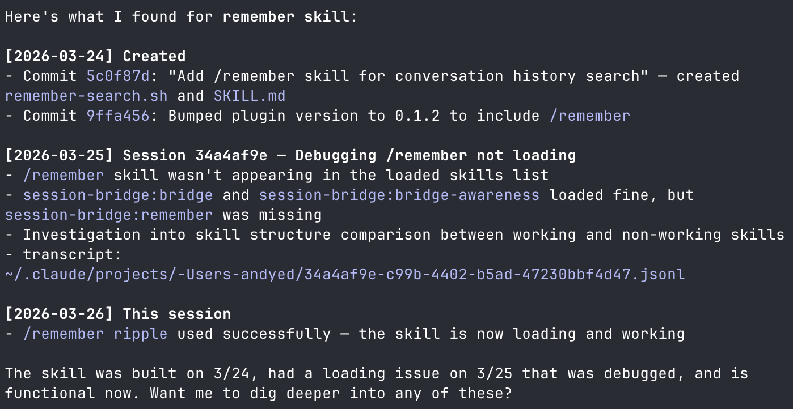
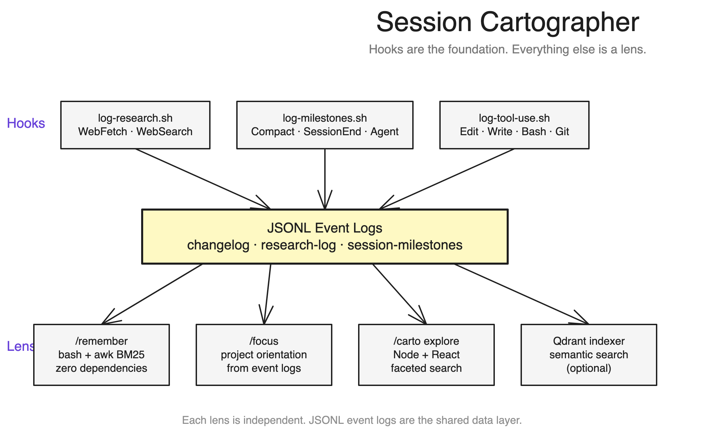

# Session Cartographer

Searchable memory for Claude Code. Hooks capture every URL fetched, file edited, git commit, and context compaction. Search fuses BM25 keyword scoring with vector similarity via Reciprocal Rank Fusion — then facets the results by project, event type, source, and time.



## What you get

- **`/remember`** — Ask Claude to recall past decisions, research, fixes. Runs BM25 + RRF search across event logs and transcripts. Zero dependencies (bash + awk).
- **`/carto`** — Visual Explorer with timeline, faceted search, and transcript viewer. Click a facet pill to narrow by project or event type. Click a timeline dot to jump to that result.
- **Faceted search** — Server computes distributions over the top 500 fused results. Filter by project, event type (fetch/search/commit/edit/bash), and match source (keyword/semantic). Client-side filtering, URL-persisted state.
- **Hybrid ranking** — BM25 keyword scoring + Qdrant semantic similarity, merged via RRF (k=60). Graceful degradation — keyword-only if Qdrant isn't running.

## Install

```bash
git clone https://github.com/andyed/session-cartographer.git
claude install /path/to/session-cartographer
```

That's it. Hooks auto-register and start logging immediately. `/remember` works with keyword search out of the box.

### Explorer (web UI)

```bash
cd session-cartographer/explorer && npm install && npm run dev
# API on :2526, UI on :2527
```

Then use `/carto` to open it in your browser.

### Semantic search (optional)

Adds vector similarity to the keyword pipeline. Both always run, results fuse via RRF. No Docker — two binaries, under 1GB total. See [docs/SETUP.md](docs/SETUP.md).

### Add to your CLAUDE.md

After installing, add this so the agent knows to use cartographer:

```markdown
## Session History

Session Cartographer is installed. Two skills:
- `/remember <query>` — search past session history (decisions, research, fixes)
- `/carto` — open the Explorer web app for visual browsing

When you need context from a previous conversation, use `/remember`. The skill
runs BM25 + RRF search across event logs and transcripts. Read the transcript
path from results to recover full conversation context.
```

## Cold start

Hooks only capture events going forward. On a fresh install your event logs are empty — that's expected. You'll start seeing results after a few sessions of normal Claude Code use.

To backfill existing history:

```bash
# Git commits across your repos (fast, no Qdrant needed)
bash scripts/backfill-git-history.sh --since 2026-01-01

# Claude Code memory files (feedback, project notes)
bash scripts/backfill-memories.sh

# Historical transcripts into Qdrant (requires Qdrant + embedding server)
bash scripts/retro-index.sh --limit-days 30

# Deep reconstruction — extracts tool_use blocks, synthesizes research events
node scripts/reconstruct-history.js
```

## Footprint

```
  Disk footprint (1,839 sessions, 40+ projects)

  Claude Code transcripts  ████████████████████████████████████  2,900 MB
    Cartographer log data  ▏                                      1.5 MB
      Cartographer source  ▏                                        2 MB

  Cartographer adds ~1 MB per 2 GB of transcripts (1:2000)
```

grep scans 2.7 GB of transcripts in 30-50s per query, returning raw JSONL. Cartographer searches a 1.5 MB index in under a second — 69× faster, ranked and formatted.

## Architecture

Hooks are the foundation. Everything else is a lens.



Each layer is independent. You can use `/remember` without the Explorer, `/focus` without `/remember`, or just the hooks with your own tooling. The JSONL event logs ([schema](docs/LOG_SCHEMAS.md)) are the shared data layer.

## What gets logged

| Hook | Triggers on | Captures |
|------|-------------|----------|
| `log-research.sh` | WebFetch, WebSearch | URLs, search queries, auto-categorization |
| `log-session-milestones.sh` | PreCompact, SessionEnd, SubagentStop | Session lifecycle with deep links |
| `log-tool-use.sh` | Edit, Write, Bash | File modifications, git commits, commands (opt-in: `CARTOGRAPHER_LOG_TOOL_USE=true`) |

Event types are dynamic — they depend on which hooks you enable and how you use Claude Code. Run `jq -r '.type' ~/Documents/dev/changelog.jsonl | sort | uniq -c | sort -rn` to see your actual type distribution.

## Configuration

All paths and endpoints are configurable via environment variables. See [docs/SETUP.md](docs/SETUP.md) for the full table.

### Extend session transcript retention

Claude Code deletes transcripts after 30 days by default. Extend in `~/.claude/settings.json`:

```json
{
  "cleanupPeriodDays": 365
}
```

A year of event logs is ~8 MB. Your session history is the training data for your future workflow — keep it.

## Tradeoffs

**Speed vs. recall:** grep scans everything (30-50s). Cartographer searches a 1.5MB index (sub-second, ranked) but only finds what hooks captured. Mitigations: `CARTOGRAPHER_LOG_TOOL_USE=true`, transcript grep fallback, Qdrant backfill.

**BM25 handles Latin scripts only.** Accented characters normalized (`résumé` → `resume`). CJK/RTL needs semantic search, which is multilingual natively.

**No stemming.** `shader*` for prefix matching. See [query rewrite roadmap](docs/query_rewrite_spec.md).

## Deep linking

Hooks write [`claude-history://`](docs/PERMALINK_SPEC.md) URIs into every event — stable references into Claude Code session transcripts. The Explorer resolves these natively. Fragment references for anchoring into specific conversation moments are on the [roadmap](docs/PERMALINK_SPEC.md#roadmap-fragment-references).

## See also

- [docs/SETUP.md](docs/SETUP.md) — Full setup, Qdrant, environment variables, disk usage
- [docs/RANK_FUSION.md](docs/RANK_FUSION.md) — BM25 + RRF scoring architecture
- [docs/SCORING.md](docs/SCORING.md) — What scores mean, when to chase a result
- [docs/CUSTOM_HOOKS.md](docs/CUSTOM_HOOKS.md) — Log your own events to the index
- [docs/LOG_SCHEMAS.md](docs/LOG_SCHEMAS.md) — JSONL schemas for all event types
- [docs/CHANGELOG_SPEC.md](docs/CHANGELOG_SPEC.md) — Event envelope format
- [docs/EXPLORER_SPEC.md](docs/EXPLORER_SPEC.md) — Explorer implementation architecture
- [docs/PERMALINK_SPEC.md](docs/PERMALINK_SPEC.md) — `claude-history://` URI scheme
- [docs/landscape-survey.md](docs/landscape-survey.md) — 30+ Claude Code memory projects compared

## Uninstall

```bash
claude uninstall session-cartographer                    # remove plugin + hooks
# Optionally delete event logs:
rm ~/Documents/dev/changelog.jsonl ~/Documents/dev/research-log.jsonl ~/Documents/dev/session-milestones.jsonl
rm -rf ~/Documents/dev/session-cartographer              # the repo
```

## Attribution

Search concept originated in a fork of [claude-code-session-bridge](https://github.com/PatilShreyas/claude-code-session-bridge) by Shreyas Patil (MIT License).

## License

MIT
