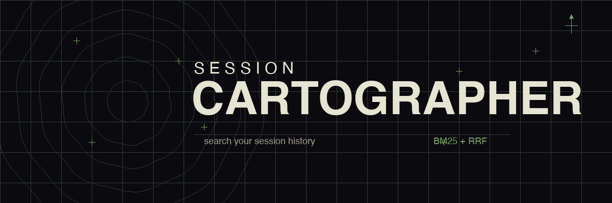

# Session Cartographer



Search your Claude Code session history, or better yet, have Claude do it for you with `/remember`. 

**The Origin Problem:** When Claude does deep literature reviews or explores extensive documentation, it reads dozens of URLs via `WebFetch` and `WebSearch`—but leaves no permanent, searchable trace of what it actually studied once the session ends. 

Cartographer fixes this by creating a lightweight metadata index via bash hooks during critical moments in your sessions (like permanently logging every URL and research paper that was fetched). This preserves your research trace forever, surviving past Claude's default 30-day history retention purge!

But the utility quickly expanded beyond securing web research. By additionally intercepting the files Claude edits, the Bash commands it runs, and the moments context size peaks, Cartographer builds a complete topological map of your session evolution.

To query this map, it fuses Semantic Similarity (via optional Qdrant) with Okapi BM25 keyword scoring via Reciprocal Rank Fusion. The twist? To keep dependencies strictly at zero, the entire BM25 search engine is implemented purely in `awk`.


## grep vs. cartographer

Default Claude Code search is `grep -r` on transcript files — raw JSON, no ranking, no event logs. Cartographer adds BM25 scoring, event log coverage, deduplication, and RRF fusion across sources.

Benchmark against session-cartographer's own development history (8 queries, 1,839 transcript files, 2.7GB):

```
                           ── grep ──        ── carto ──
Query                       hits    sec       hits    sec
─────────────────────────  ────── ──────     ────── ──────
"BM25 scoring"                 4   32.8         4    0.5
"rank fusion awk"              1   37.7         6    0.7
"session cartographer"         5   49.4        15    0.7
"hook log research"            1   45.9        15    0.6
"cold start"                  82   34.2         3    0.5
"Qdrant embedding"             7   35.4         0    0.5
"real-time indexing"           3   47.4        15    0.7
"JSONL event"                  5   46.8         1    0.6
─────────────────────────  ────── ──────     ────── ──────
TOTAL                        108  329.8        59    4.8
```

grep takes 33-49 seconds per query scanning 2.7GB of transcripts, returning raw JSONL blobs. Cartographer returns BM25-ranked, formatted results in under a second.

## How it works

Hooks log session events (web fetches, searches, compactions, file edits) to append-only JSONL files (~1.5 MB for 3,000 events — a 1:2000 ratio to Claude's own transcript data).

The Explorer server loads all events into memory at startup (~7 MB for 3,000 events) and builds a BM25 corpus — term frequencies, document frequencies, average document length. This corpus lives in memory for the server's lifetime. Queries score against it in sub-millisecond time with zero disk I/O. New events are added incrementally via file watcher.

```
Startup:  JSONL files → in-memory BM25 corpus (7 MB, built once)
Query:    tokenize → score 2,000 docs → sort → top N    (~1 ms)
Live:     fs.watch → addToIndex() → SSE push to UI      (real-time)
```

Optional Qdrant integration adds semantic search — both keyword and vector results fuse through the same RRF pipeline.

The CLI search path (`cartographer-search.sh`) uses pure awk for BM25 — no Node, no jq dependency.

## Install

```bash
git clone https://github.com/andyed/session-cartographer.git
claude install ./session-cartographer
```

Or use standalone (no plugin install needed):
```bash
bash scripts/cartographer-search.sh "your query" --project myproject --limit 10
```

### Add to your CLAUDE.md

After installing, add this to your project or global `CLAUDE.md` so the agent knows to use cartographer:

```markdown
## Session History

Use `/remember <query>` to search past session history when you need context
from previous conversations — decisions, research, fixes, approaches. The
search uses BM25 + RRF across event logs and transcripts. Don't freestyle
grep on transcript files — always use the search script.

When the Explorer is running (localhost:2527), use `/explore <query>` to open
a visual search in the browser, or link to it from /remember results.
```

### Extend your session history

Claude Code deletes transcripts after 30 days by default. Cartographer is more useful the more history it can search. Extend retention in `~/.claude/settings.json`:

```json
{
  "cleanupPeriodDays": 365
}
```

A year of transcripts is ~16 GB for a heavy user (extrapolating from 1,839 sessions in 63 days). But because Cartographer's hooks only extract high-signal *events* (not the chatty conversational text), the resulting metadata index is a fraction of the size. A full year of activity produces just ~8 MB of event logs—scoring against it takes milliseconds and effectively zero memory overhead. Your session history is the training data for your future workflow — keep it.

## What gets logged

| Hook | Triggers on | Captures |
|------|-------------|----------|
| `log-research.sh` | WebFetch, WebSearch | URLs, search queries, auto-categorization |
| `log-session-milestones.sh` | PreCompact, SessionEnd, SubagentStop | Session lifecycle with deep links |
| `log-tool-use.sh` | Edit, Write, Bash | File modifications, commands (opt-in: `CARTOGRAPHER_LOG_TOOL_USE=true`) |

Transcripts (`~/.claude/projects/*/*.jsonl`) are also searched directly.

All paths configurable via `CARTOGRAPHER_DEV_DIR` and `CARTOGRAPHER_TRANSCRIPTS_DIR`.

## Semantic search (optional)

With a local Qdrant binary + llama.cpp embedding server, `/remember` adds vector similarity to the keyword pipeline. Both always run, results fuse via RRF. See [docs/SETUP.md](docs/SETUP.md). No Docker — two binaries, under 1GB total.

## Tradeoffs: speed vs. recall

The core tradeoff: grep scans 2.7GB of raw transcripts and finds *everything* — perfect recall, 30-50 seconds per query, unranked. Cartographer searches a 1.5MB event index — sub-second, ranked, but only finds what the hooks captured.

**Recall is our main challenge.** If a decision was made in conversation but no hook fired (no WebFetch, no file edit, no compaction), it only exists in the raw transcript. The fast JSONL path won't find it. Mitigations:
- `CARTOGRAPHER_LOG_TOOL_USE=true` captures Edit/Write/Bash events
- The CLI search falls back to transcript grep when the index returns too few results
- Qdrant backfill via `retro-index.sh` or `reconstruct-history.js` indexes historical transcripts (see [docs/SETUP.md](docs/SETUP.md))

## Other limitations

- **BM25 matches whole tokens, not substrings.** Searching `"shader"` won't match `"shaders"`. No stemming. Multi-word queries try exact phrase first, fall back to AND (all words present, any order) if too few results.
- **awk JSON extraction is fragile.** Works for the flat JSONL schemas we control. Escaped quotes in values will break field extraction.
- **Ranking is by BM25 score within source, then RRF across sources.** Not a relevance model — a document mentioning your query word 3 times scores higher than one mentioning it once, regardless of context.

## Deep link viewer

Cartographer includes a built-in transcript viewer (the Explorer at `:2527`), but the plan is to support [claude-code-history-viewer](https://github.com/jhlee0409/claude-code-history-viewer) as an alternate deep link handler. Set `CARTOGRAPHER_VIEWER_PREFIX` to route links to whichever viewer you prefer:

```bash
# Built-in Explorer (default)
CARTOGRAPHER_VIEWER_PREFIX="http://localhost:2527/session/"

# claude-code-history-viewer
CARTOGRAPHER_VIEWER_PREFIX="claude-history://session/"
```

**TODO:** Wire `CARTOGRAPHER_VIEWER_PREFIX` into `/remember` CLI output and EventCard links so the viewer is fully swappable.

## Landscape

There are 30+ projects augmenting Claude Code's memory and session management. They fall into distinct categories — cartographer occupies the navigation/search niche that most memory projects ignore.

| Category | Examples | What they do |
|----------|----------|-------------|
| **Persistent memory** | [claude-mem](https://github.com/thedotmack/claude-mem) (40k stars), [cortex](https://github.com/hjertefolger/cortex), [claude-supermemory](https://github.com/supermemoryai/claude-supermemory) | Write facts forward into future sessions |
| **Cross-session search** | [episodic-memory](https://github.com/obra/episodic-memory), [recall](https://github.com/joseairosa/recall), **session-cartographer** | Find things from past sessions |
| **Session visualization** | [claude-code-history-viewer](https://github.com/jhlee0409/claude-code-history-viewer) (726 stars), [ccstat](https://github.com/ktny/ccstat) | Browse and display transcripts |
| **Knowledge graphs** | [mcp-memory-service](https://github.com/doobidoo/mcp-memory-service) (1.6k stars), [memsearch](https://github.com/zilliztech/memsearch) | Structured entity/relation storage |
| **Cognitive architectures** | [claude-cognitive](https://github.com/GMaN1911/claude-cognitive), [Continuous-Claude-v3](https://github.com/parcadei/Continuous-Claude-v3) (3.6k stars) | Attention-based memory tiers, multi-agent frameworks |

Cartographer is different: it doesn't store knowledge — it indexes the *events* of your sessions (research, edits, milestones) and makes them searchable with [BM25 scoring](docs/RANK_FUSION.md) and [interpretable scores](docs/SCORING.md). Full survey with 30+ projects: [docs/landscape-survey.md](docs/landscape-survey.md).

## See also

- [docs/RANK_FUSION.md](docs/RANK_FUSION.md) — How BM25 + RRF scoring works
- [docs/SCORING.md](docs/SCORING.md) — What scores mean, when to chase a result
- [docs/CUSTOM_HOOKS.md](docs/CUSTOM_HOOKS.md) — Log your own events to the index
- [docs/SETUP.md](docs/SETUP.md) — Qdrant + embedding server setup, cold start backfill
- [docs/EXPLORER_SPEC.md](docs/EXPLORER_SPEC.md) — Companion web UI architecture

## Attribution

Search concept originated in a fork of [claude-code-session-bridge](https://github.com/PatilShreyas/claude-code-session-bridge) by Shreyas Patil (MIT License).

## License

MIT
