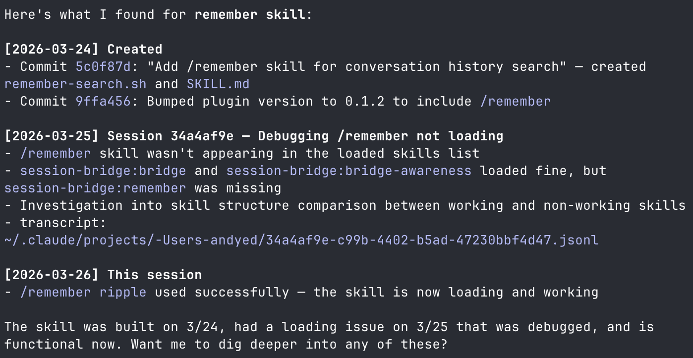
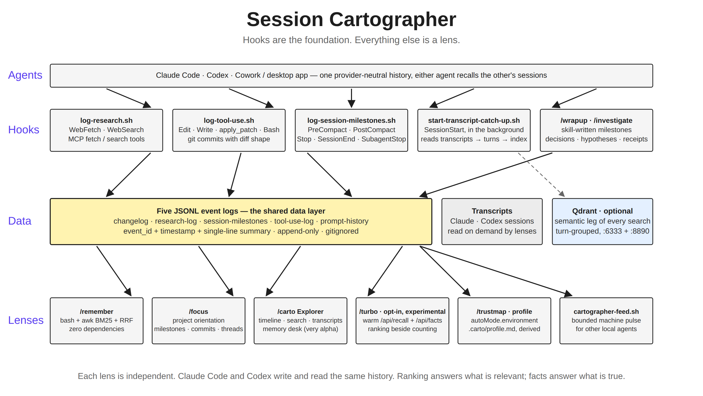

# Session Cartographer

Searchable memory for Claude Code and Codex. Hooks capture URLs, file edits,
git commits, and lifecycle events into one provider-neutral JSONL history.
Search fuses BM25 keyword scoring with vector similarity via Reciprocal Rank
Fusion — then facets the results by project, event type, source, and time.



**[Live demo →](https://andyed.github.io/session-cartographer/)** — Explorer running against a test set from building Session Cartographer with Claude Code. Try the example queries.

## What you get

- **`/remember`** — Ask Claude or Codex to recall past decisions, research, and fixes from either agent. Runs BM25 + RRF search across event logs and transcripts. Zero dependencies (bash + awk).
- **`/focus`** — Orient on a project before diving in: recent milestones and commits, plus cross-project research threads and recurring maneuvers from the co-occurrence graph.
- **`/carto`** — Visual Explorer with timeline, faceted search, and transcript viewer. Click a facet pill to narrow by project or event type. Click a timeline dot to jump to that result.
- **`/wrapup`** — Promotes a material session into strategic memory. It renders a [session digest](#the-session-digest), then records decisions, discoveries, and unfinished threads with separate, verified receipts for the durable JSONL write and semantic index. Structured `decisions[]` feed the standing profile; ordinary sessions remain preserved by transcripts and hooks without requiring manual synthesis.
- **`/trustmap`** — Derives auto mode's `autoMode.environment` from the corpus: the source-control orgs, LAN hosts, buckets, data stores, and non-standard CLIs your work actually touches, each with a hit count. **Not a replacement for Claude Code's built-in setup wizard** — on a fresh install that wizard is the better tool, since it scans the machine directly and needs no history. Check what it scanned before accepting its write, though: a run scoped to one project — or to a git worktree, which gets its own transcript directory — pins the otherwise-dynamic `Trusted repo` and `Primary use` entries to that project, at user scope. This is the *update* path: once a corpus exists, proposals are usage-weighted (a repo you pushed to twenty-seven times outranks one that merely exists under `$HOME`), span Codex as well as Claude sessions, and are diffed against your current settings so a re-run proposes only the delta. On a thin corpus it says so and hands you a fill-in template instead of a confident-looking panel built from forty events.
- **`/investigate`** — Diagnosis gate for bug work. Forces a written root-cause hypothesis (cause + mechanism + disproof) before any fix code, and logs it as a searchable event for later recall.
- **`.carto/profile.md`** — A derived standing summary of the whole corpus: active projects, standing preferences, durable decisions, work shape, cadence. Start recall here when the question is about the shape of the work rather than one past moment. Rebuild with `node scripts/build-profile.js`; never hand-edit — it regenerates.
- **Exact fetch (`--get`)** — Search output is lossy by design: summaries are single-line and truncated for display. `--get evt-a,evt-b` returns the complete records — `transcript_path`, `files_changed`, `diff_shape` — so a shortlist can be checked before committing to a 100MB transcript. Missing ids are reported, not silently dropped.
- **Delta serving** — Repeat `/remember` calls in one session suppress ids already returned, so each call surfaces fresh material instead of the same top-K. `--all` bypasses it.
- **Faceted search** — Server computes distributions over the top 500 fused results. Filter by project, event type (fetch/search/commit/edit/bash), and match source (keyword/semantic). Client-side filtering, URL-persisted state.
- **Hybrid ranking** — BM25 keyword scoring + Qdrant semantic similarity, merged via RRF (k=60). Graceful degradation — keyword-only if Qdrant isn't running.
- **Bounded machine feeds** — `scripts/cartographer-feed.sh` turns an explicit project allowlist and time window into a compact, summary-only Markdown pulse for another local agent or scheduled job. It does not copy the index or pollute human recall telemetry; see [Project Registry & Briefings](docs/BRIEFINGS.md#bounded-machine-feeds).

## The session digest

`/wrapup` opens by rendering the session, not by describing it. Every line
traces back to a logged event or to `git`, so a wrong claim is visible rather
than merely plausible — prose lets an agent assert that a session went well;
a panel either matches `git log` or it doesn't.

This is a real session from this repository:

```
━━ session digest · session-cartographer ━━━━━━━━━━━━━━━━━━━━━━━━━━━━━━━━━━━━━━━━━━━

  session   e2ab97ba · claude · 154 events
  span      2026-03-27 02:01 → 2026-03-29 15:00 UTC · 60h59m
  tempo     ▂···········▁·····▁█▁▆·▁▁▁·····▁  (1h54m/mark)
  projects  session-cartographer 128 · andyed 14 · nokings-blipper-firetv 7 · scipr…
  activity  47 edits · 67 bash · 1 compaction · subagents Explore×6,Plan

  commits   16 · 2 pushes
            16 other  ▸  2 construct · 2 surgical

            03-29 03:11  57ee5c2  feat: Concurrent timeline, diff shape …  +1010 −65
            03-29 00:58  9cfb01b  chore: tablet + general store assets (…
            03-28 22:45  8d7dec2  fix: even timing across all chunks — n…
            … 13 more

  files     13 touched
            explorer/src/components/SearchInput.jsx                             ×18
            README.md                                                           ×9
            explorer/server/index.js                                            ×4

  leaving   sciprogfi-web@main                  37 uncommitted
            session-cartographer@main           2 uncommitted

━━━━━━━━━━━━━━━━━━━━━━━━━━━━━━━━━━━━━━━━━━━━━━━━━━━━━━━━━━━━━━━━━━━━━━━━━━━━━━━━━━━━
```

The **tempo** sparkline buckets every event across the span — a session resumed
over three days looks nothing like three hours of continuous work, and a
start/end timestamp pair hides the difference. **`leaving`** is the only section
with no log behind it: it is what the session is walking away from *right now*,
across every repository it touched, which is the thing that actually gets
forgotten.

Sections appear only when they have content. A `recall` line shows
`/remember` calls served against uses actually vouched for with `--touch`;
`research` lists the hosts fetched. The session above has neither.

It serves two readers. You get a session you can check; the agent gets ground
truth to write its synthesis against, instead of recalling the conversation from
its own memory of it. Run it directly on any session:

```bash
node scripts/session-digest.js --session <id>     # or --json for the raw numbers
```

### Wrapup coverage

`/wrapup` is selective curation, not the ingestion layer. Transcripts and hooks
preserve every observable session automatically; a synthesis is useful when a
completed session contains edits, commits, compaction, multiple projects, or
enough duration/activity to carry decisions worth recovering. A derived report
keeps that selection bias visible without adding another mutable queue:

```bash
node scripts/wrapup-coverage.js                    # pending material sessions
node scripts/wrapup-coverage.js --session <id>     # one session's status
node scripts/wrapup-coverage.js --json             # coverage + queue for tooling
```

The denominator is completed or stale **material** sessions, not every short
question. Active material sessions and trivial sessions are reported outside
the percentage. Defaults are tunable with
`CARTOGRAPHER_WRAPUP_MIN_EVENTS`, `CARTOGRAPHER_WRAPUP_MIN_MINUTES`, and
`CARTOGRAPHER_WRAPUP_STALE_HOURS`.

## Co-occurrence graph & maneuver map

`scripts/cooccurrence-graph.js` builds a significance-weighted co-occurrence graph over the **structured** fields in your event logs (projects, detected tech-signals) — never tokenized prose. One scoring engine, two graphs. Zero external dependencies (Node `fs`/`path`/`os` only). It's wired into `/focus` (related threads + maneuvers) and `/remember` (`--signal` procedural recall), with an opt-in `SessionStart` hook that surfaces orientation automatically — not yet a lens in the Explorer UI. Method doc: [docs/COOCCURRENCE.md](docs/COOCCURRENCE.md).

- **Project co-activity** — `--related <project>` surfaces cross-project research threads. The document is a calendar **day**, not a session: 97% of sessions touch a single project, so the cross-thread signal lives in same-day co-activity, not same-session.
- **Maneuver map** — `--maneuvers <project>` shows a project's procedure profile (detected signals like `ff-merge`, `gh-release`, `cloudflare-pages`, `netlify`, `overleaf-sync`) and which other projects share it. Two views: *composition* (signal × signal, which markers compose one maneuver) and *transfer* (project × project, which projects share a procedure).

```bash
# Cross-project threads co-active with a project (shared days · G²)
node scripts/cooccurrence-graph.js --related approach-retreat

# A project's maneuver profile + the projects that share it (shared signals · G²)
node scripts/cooccurrence-graph.js --maneuvers psychodeli

# Which projects run a maneuver, and what it composes with (powers /remember "how do I deploy X")
node scripts/cooccurrence-graph.js --signal cloudflare

# Build the full graph, write JSON, print top edges
node scripts/cooccurrence-graph.js --show both
```

Edges are ranked by **Dunning's log-likelihood ratio (G², Dunning 1993)** — observed-vs-expected co-occurrence that scales with the evidence. See [Inspiration](#inspiration) for the lineage.

**Auto-focus (opt-in).** Set `CARTOGRAPHER_FOCUS_ON_START=1` and a `SessionStart` hook injects the related-threads + maneuver lenses as context when you enter a project — dormant by default, abstains on home-dir launches, and surfaces once per project per day. The `--related` lens is gated by a G² stability heuristic so solo-project coincidence never reaches you.

## Install

The GitHub release ships **one unified bundle for both agents**—there are no
separate Claude and Codex packages. Download and extract
`session-cartographer-<version>.tar.gz`, then run one of these from the
extracted directory:

```bash
# Codex
codex plugin marketplace add "$PWD"
codex plugin add session-cartographer@session-cartographer

# Claude Code
claude plugin marketplace add "$PWD"
claude plugin install session-cartographer@session-cartographer
```

### Required Codex hook approval

Codex skips newly installed or changed command hooks until you explicitly trust
their exact definitions. Hook review is currently available in the **Codex CLI**,
not the desktop app:

```bash
cd /path/to/your/project
codex
# Then type /hooks, select Session Cartographer, and approve its hooks.
```

If the desktop app is your only Codex entry point on macOS, its bundled CLI is:

```bash
/Applications/ChatGPT.app/Contents/Resources/codex
```

After approval, start a fresh task/session. Hooks then log automatically;
`/remember` works with keyword search out of the box. The SessionStart hook runs
a checkpointed, non-blocking Codex transcript catch-up at most once every 15
minutes. Changed hooks must be reviewed again because Codex trusts their content
hash, not just the plugin name.

For development, clone the repository and register the checkout itself as the
marketplace. Release archives are self-contained: installed skills, hooks,
search scripts, and the Explorer do not reach back into a source checkout.

### Explorer (web UI)

```bash
cd session-cartographer/explorer && npm install && npm run dev
# API on :2526, UI on :2527
```

Then use `/carto` to open it in your browser.

### Semantic search (optional)

Adds vector similarity to the keyword pipeline. Both always run, results fuse via RRF. No Docker — two binaries, under 1GB total. See [docs/SETUP.md](docs/SETUP.md).

### Add to your CLAUDE.md

After installing, add this so the agent knows to use cartographer:

```markdown
## Session History

Session Cartographer is installed. Skills:
- `/remember <query>` — search past session history (decisions, research, fixes)
- `/focus <project>` — orient on a project before diving in
- `/carto` — open the Explorer web app for visual browsing
- `/wrapup` — promote a material session into strategic memory (decisions, discoveries, next steps)
- `/investigate <bug>` — root-cause diagnosis gate before writing fix code
- `/trustmap` — derive or update auto mode's `autoMode.environment` from the corpus

When you need context from a previous conversation, use `/remember`. The skill
runs BM25 + RRF search across event logs and transcripts. Read the transcript
path from results to recover full conversation context.

For standing questions — "what am I working on", "what's my usual release
process" — read `.carto/profile.md` first. It is a derived summary of the whole
corpus; a specific "when did we fix the blur bug" should go straight to search.
```

## Upgrading from before 0.5.1

Two one-time recoveries. Both are dry-run by default and take a `.bak` before
writing. Skip them on a fresh install — there is nothing to repair.

```bash
node scripts/repair-orphan-sessions.js      # then --write
node scripts/backfill-investigations.js     # then --write --index
```

**Why they exist.** Until 0.5.0 every consumer resolved the active session from
`CLAUDE_SESSION_ID`, a variable Claude Code has never set — the exported name is
`CLAUDE_CODE_SESSION_ID`. Nothing crashed and nothing was logged. Delta serving
never activated, and `/wrapup` stamped `session_id: "unknown"` on records whose
transcript lookup then failed, leaving them as top-ranked dead ends in
`/remember`. The first script walks those back to their session by project and
nearest-event proximity. Separately, `/investigate` wrote its hypotheses to
`.carto/events/`, which nothing reads; the second normalizes them into the
searched log.

Expect a mixed result and read the dry run. On the reference corpus the session
repair recovered 33% with a verified transcript, refused 23% as ambiguous, and
found 42% unrecoverable — recovery depends on how many sessions you run
concurrently and how much history predates your transcripts' ~30-day TTL.
Records that cannot be placed confidently keep `session_id: "unknown"`. That is
deliberate: a wrong session id is worse than a missing one, because it points
`/remember` at an unrelated conversation and presents it as the real thing.

`.carto/profile.md`'s "Durable decisions" section fills from `/wrapup`'s
structured `decisions[]`, which only exists from 0.5.1 onward. Older syntheses
keep their prose and are not rewritten; the section stays thin until new wrapups
accumulate, and `build-profile.js` warns on stderr when it is drawn from too
small a slice.

## Cold start

Hooks only capture events going forward. On a fresh install your event logs are empty — that's expected. You'll start seeing results after a few sessions of normal Claude Code use.

To backfill existing history:

```bash
# Git commits across your repos (fast, no Qdrant needed)
bash scripts/backfill-git-history.sh --since 2026-01-01

# Claude Code memory files (feedback, project notes)
bash scripts/backfill-memories.sh

# Historical transcripts into Qdrant (requires Qdrant + embedding server)
bash scripts/retro-index.sh --limit-days 30

# Deep reconstruction — extracts tool_use blocks, synthesizes research events
node scripts/reconstruct-history.js

# Tag indexed transcript turns with a prompt-intent (run after the Qdrant
# backfills above) — enables `cartographer-search.sh --intent KEY` and the
# intents facet. reconstruct-history.js already tags turns it indexes itself;
# this catches turns indexed before intent classification was added.
node scripts/backfill-prompt-intents.js
```

## Footprint

```
  Disk footprint (1,839 sessions, 40+ projects)

  Claude Code transcripts  ████████████████████████████████████  2,900 MB
    Cartographer log data  ▏                                      1.5 MB
      Cartographer source  ▏                                        2 MB

  Cartographer adds ~1 MB per 2 GB of transcripts (1:2000)
```

## grep vs. cartographer

Measured on 2.9 GB of transcripts, 4,400 indexed events, 186 sessions. Metric is unique sessions surfaced — the unit that matters for recovering context.

```
                            ── grep ──         ── cartographer ──
Query                       sessions    sec    sessions    sec
──────────────────────────  ────────  ──────   ────────  ──────
"BM25"                           73    18.3         11     1.5
"facets"                         45    24.5         19     1.5
"transcript viewer"              21    20.5         14     1.6
"backfill"                       49    25.2         17     1.5
"concurrent timeline"            10    26.2         15     1.5
"diff shape"                     14    26.0         27     1.5
"session milestones"             27    21.2         42     1.6
"fisheye autocomplete"            7    25.5         12     1.5
──────────────────────────  ────────  ──────   ────────  ──────
MEAN                             31    23.4         20     1.5
```

Cartographer is **15× faster** on average. grep session counts are inflated by CLAUDE.md content echoed in every session and compaction summaries that parrot parent conversations. Cartographer deduplicates through event-level indexing: each git commit, URL fetch, and milestone is one event with a session_id linking back to the source transcript.

For queries that only appear in conversation text (not in indexed events), cartographer falls back to transcript search via ripgrep + BM25 — slower but still ranked.

### Where grep still wins

The speed numbers above compare the wrong things. grep searches raw conversation text across 2.9 GB of transcripts. Cartographer searches a 1.5 MB event index. They have different recall surfaces: grep finds anything ever said in a session; cartographer only finds what hooks captured (commits, fetches, milestones, file edits). For terms like "facets" that never appear in event logs — only in conversation — cartographer's keyword path returns nothing until the transcript fallback kicks in, which is slower than grep.

Cartographer's real advantage is **ranking and deduplication**, not coverage. grep returns 73 sessions for "BM25" because the term appears in echoed CLAUDE.md content in every session — that's noise, not recall. Cartographer returns 11 sessions with ranked, deduplicated events linked to source transcripts. The hybrid path (BM25 + Qdrant semantic) adds phrase-level understanding that bag-of-words keyword search can't match: "diff shape" as a concept vs. "diff" and "shape" as independent words. [Evaluation results and phrase matching roadmap →](docs/GHPAGES_DEMO_SPEC.md#ground-truth--evaluation)

### Precision evaluation (4 labeled queries)

```
          P@5    P@10   Recall   Speed
grep       —      —      75%    28.1s
BM25      0.40   0.33    79%    29.3s
hybrid    0.45   0.40    79%    28.6s
```

Hybrid (BM25 + semantic) outperforms keyword-only at every k. grep has no ranking so precision isn't measurable, but its recall is competitive. The main precision gap is multi-word queries like "diff shape" (P@5=0.0) where BM25 matches each word independently. Phrase matching via ordered bigrams or positional indexing would fix this — see the [search roadmap](TODO.md#search).

## Architecture

Hooks are the foundation. Everything else is a lens.



Each layer is independent. You can use `/remember` without the Explorer, `/focus` without `/remember`, or just the hooks with your own tooling. The JSONL event logs ([schema](docs/LOG_SCHEMAS.md)) are the shared data layer.

There is no global Claude/Codex mode. Each hook invocation and normalized turn
carries provider provenance, while both agents search the same logs and Qdrant
collection by default. Claude can therefore recall a Codex session and Codex
can recall a Claude session. Raw provider formats are isolated behind separate
transcript adapters. See [Provider Architecture](docs/PROVIDERS.md).

## What gets logged

| Hook | Triggers on | Captures |
|------|-------------|----------|
| `log-research.sh` | Claude web tools, Codex web/MCP tools | URLs, search queries, auto-categorization |
| `log-session-milestones.sh` | PreCompact, SessionEnd/Stop, SubagentStop | Provider-aware lifecycle events with transcript links |
| `log-tool-use.sh` | Edit, Write, apply_patch, Bash | File modifications, git commits, commands (opt-in: `CARTOGRAPHER_LOG_TOOL_USE=true`) |

Event types are dynamic — they depend on which hooks you enable and how you use Claude Code and Codex. Run `jq -r '.type' ~/Documents/dev/changelog.jsonl | sort | uniq -c | sort -rn` to see your actual type distribution.

## Configuration

All paths and endpoints are configurable via environment variables. See [docs/SETUP.md](docs/SETUP.md) for the full table.

### Extend session transcript retention

Claude Code deletes transcripts after 30 days by default. Extend in `~/.claude/settings.json`:

```json
{
  "cleanupPeriodDays": 365
}
```

A year of event logs is ~8 MB. Your session history is the training data for your future workflow — keep it.

## Tradeoffs

**Speed vs. recall:** grep scans everything (30-50s). Cartographer searches a 1.5MB index (sub-second, ranked) but only finds what hooks captured. Mitigations: `CARTOGRAPHER_LOG_TOOL_USE=true`, transcript grep fallback, Qdrant backfill.

**BM25 handles Latin scripts only.** Accented characters normalized (`résumé` → `resume`). CJK/RTL needs semantic search, which is multilingual natively.

**No phrase matching.** `"diff shape"` is treated as `diff OR shape`, not a phrase. Semantic search (Qdrant) handles this implicitly — the embedding captures the concept. The keyword path doesn't. Ordered bigram injection (SDM-lite) was attempted and reverted after measuring zero P@5 delta on 9 truth queries with a 33% indexing-cost regression — the motivating `diff shape` case is dominated by events that already win on filename tokenization (e.g. `diff-shape.sh`), so bigrams don't shift rank. See [phrase matching TODO](TODO.md#search) for the revised plan.

**No stemming.** `shader*` for prefix matching. See [query rewrite roadmap](docs/query_rewrite_spec.md).

## Deep linking

Hooks write [`claude-history://`](docs/PERMALINK_SPEC.md) URIs into every event — stable references into Claude Code session transcripts. The Explorer resolves these natively. Fragment references for anchoring into specific conversation moments are on the [roadmap](docs/PERMALINK_SPEC.md#roadmap-fragment-references).

## Evaluation

Search quality is measured against labeled ground truth — graded relevance judgments for each result across 4 test queries. Truth data is checked in at `explorer/public/demo/demo/truth/`.

Each truth file records:
- **Query intent** — what the user is actually trying to find
- **Session relevance** — which sessions are primary/secondary sources
- **Per-result grades** — 0 (noise) to 3 (exact match), with noise classification (`single_word_match`, `compaction_echo`, etc.)

The same data powers the [live demo](https://andyed.github.io/session-cartographer/) and the precision/recall benchmarks above. Run the full test suite:

```bash
bash tests/private/run-tests.sh        # 11 tests against live data
bash tests/private/run-fixture-tests.sh # 14 tests against fixtures
bash tests/private/benchmark.sh         # 8-query speed comparison
```

## See also

- [docs/SETUP.md](docs/SETUP.md) — Full setup, Qdrant, environment variables, disk usage
- [docs/MIGRATION_TURNS.md](docs/MIGRATION_TURNS.md) — Existing-user migration to turn-based transcript indexing
- [docs/RANK_FUSION.md](docs/RANK_FUSION.md) — BM25 + RRF scoring architecture
- [docs/SCORING.md](docs/SCORING.md) — What scores mean, when to chase a result
- [docs/CUSTOM_HOOKS.md](docs/CUSTOM_HOOKS.md) — Log your own events to the index
- [docs/LOG_SCHEMAS.md](docs/LOG_SCHEMAS.md) — JSONL schemas for all event types
- [docs/CHANGELOG_SPEC.md](docs/CHANGELOG_SPEC.md) — Event envelope format
- [docs/EXPLORER_SPEC.md](docs/EXPLORER_SPEC.md) — Explorer implementation architecture
- [docs/INTERNALS.md](docs/INTERNALS.md) — On-demand utility, coverage, and operations view
- [docs/TURBO_MODE_SPEC.md](docs/TURBO_MODE_SPEC.md) — Opt-in, utility-first sequence for routing `/remember` through the warm Explorer index
- [docs/PERMALINK_SPEC.md](docs/PERMALINK_SPEC.md) — `claude-history://` URI scheme
- [docs/landscape-survey.md](docs/landscape-survey.md) — 30+ Claude Code memory projects compared
- [docs/GHPAGES_DEMO_SPEC.md](docs/GHPAGES_DEMO_SPEC.md) — Demo site architecture + ground truth evaluation spec
- [Live demo](https://andyed.github.io/session-cartographer/) — Try the Explorer against real test data

## Uninstall

```bash
claude uninstall session-cartographer                    # remove plugin + hooks
# or: codex plugin remove session-cartographer@session-cartographer
# Optionally delete event logs:
rm ~/Documents/dev/changelog.jsonl ~/Documents/dev/research-log.jsonl ~/Documents/dev/session-milestones.jsonl
rm -rf ~/Documents/dev/session-cartographer              # the repo
```

## Inspiration

The co-occurrence graph above is a direct response to [lume](https://github.com/DeepBlueDynamics/lume) by DeepBlueDynamics — its Rust hybrid-search engine carries a Semantic Knowledge Graph layer (entity co-occurrence with significance weighting) that prompted us to ask what the same idea would surface over session entities instead of documents.

We adapted it in two ways. First, the entities: lume scores co-occurrence across a corpus of documents; we score it over **structured session entities** (projects, detected tech-signals), never tokenized prose. Second, the statistic: lume ranks by a z-score passed through `tanh`, which *saturates* — for a perfectly-correlated pair (a = b = k) the z-score collapses to √N regardless of count, so a 3-session fluke and a 30-session pattern score identically. We rank by **Dunning's log-likelihood ratio (G², Dunning 1993)** instead, which scales with the evidence.

Credit also to the deeper lineage lume itself cites: the Semantic Knowledge Graph work of **Trey Grainger and Erik Hatcher**, which framed entity co-occurrence as a significance-weighted graph in the first place.

## Attribution

Search concept originated in a fork of [claude-code-session-bridge](https://github.com/PatilShreyas/claude-code-session-bridge) by Shreyas Patil (MIT License).

## License

MIT
