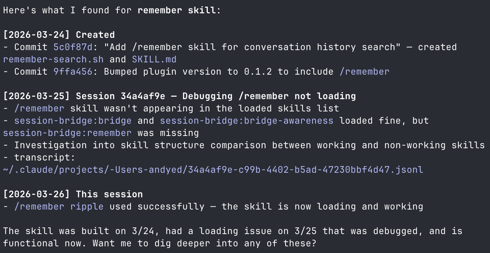
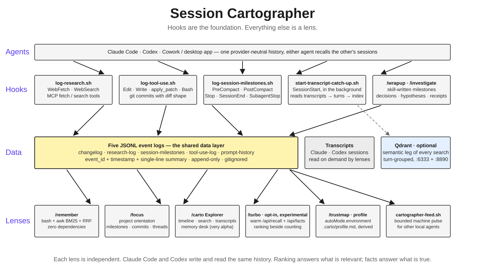

# Session Cartographer

Searchable memory for Claude Code and Codex. Hooks capture URLs, file edits,
git commits, and lifecycle events into one provider-neutral JSONL history.
Search fuses BM25 keyword scoring with vector similarity via Reciprocal Rank
Fusion — then facets the results by project, event type, source, and time.
[Turbo Mode](#turbo-mode-warm-recall-for-both-agents) keeps the index
warm so recall returns in about 0.3 s instead of about 12 s on a
150,000-event corpus, for both agents from one setting.



**[Live demo →](https://andyed.github.io/session-cartographer/)** — Explorer running against a test set from building Session Cartographer with Claude Code. Try the example queries.

## What you (and your agents) get

### Use it

**Recall**

- **`/remember`** — Ask Claude or Codex what was decided, researched, or fixed before, in either agent's sessions.
- **`/turbo`** (Claude Code) or **`$session-cartographer:turbo`** (Codex) — Turn on warm recall: about 0.3 s per `/remember` instead of about 12 s on a 150,000-event corpus. One setting covers both agents. [Details →](#turbo-mode-warm-recall-for-both-agents)
- **`/focus <project>`** — Orient before diving in: recent milestones and commits, related cross-project threads, and the project's recurring maneuvers.

**Coordinate**

- **`/standup`** — See which sessions were recently active, in which repos, and which files more than one session touched. `--commit <sha>` names the session behind a commit you did not make. A [shared-goal briefing](docs/STANDUP_SHARED_GOAL_PLAN.md) is planned; today, sharing a project is not treated as sharing an objective.

**Browse**

- **`/carto`** — Open the Explorer: timeline, faceted search, and transcript viewer. Click a facet pill to narrow by project or event type; click a timeline dot to jump to that result.
- **Memory Desk (alpha)** — A visual workspace in the Explorer for live and replayed sessions, token and activity comparisons, and per-session file review. Early and changing. [Details →](#memory-desk-alpha)

**Record judgment**

- **`/wrapup`** — Promote a material session into strategic memory: a [session digest](#the-session-digest), then its decisions, discoveries, and unfinished threads. Ordinary sessions are already preserved by hooks and need no wrapup.
- **`/investigate`** — Bring past diagnoses to a bug before fixing it, including hypotheses that were refuted; record the new root-cause hypothesis; close it as confirmed or refuted once the fix is verified.

**Set up**

- **`$session-cartographer:setup`** (Codex) — Check whether semantic search can reach local Qdrant and the embedding server, and, with your consent, add least-privilege access.
- **`/trustmap`** — Propose auto mode's `autoMode.environment` from your history: the orgs, hosts, buckets, data stores, and CLIs your work actually touches. On a fresh install, Claude Code's built-in setup wizard is the better tool. Check the scan scope before accepting: a run scoped to one project or git worktree pins `Trusted repo` and `Primary use` to that project at user scope.

**From scripts and other agents**

- **`cartographer-search.sh --get evt-a,evt-b`** — Fetch complete records (`transcript_path`, `files_changed`, `diff_shape`) for a shortlist before opening a 100 MB transcript. Missing ids are reported, not dropped.
- **`scripts/cartographer-feed.sh`** — A compact, summary-only Markdown pulse for an explicit project allowlist and time window, for another local agent or a scheduled job. See [Project Registry & Briefings](docs/BRIEFINGS.md#bounded-machine-feeds).
- **`.carto/profile.md`** — A standing summary of the whole corpus (active projects, preferences, durable decisions, work shape, cadence). Read it first when the question is about the shape of the work rather than one moment. Rebuild with `node scripts/build-profile.js`; do not hand-edit.

### How it works

- **Capture.** Hooks in both agents append URLs, file edits, commits, tool use, and lifecycle events to one provider-neutral JSONL history. Nothing is sent off the machine.
- **Hybrid ranking.** BM25 keyword scoring and Qdrant semantic similarity are merged with Reciprocal Rank Fusion (k=60). The portable path is bash + awk with no dependencies, and it falls back to keyword-only when Qdrant is not running.
- **Warm index (Turbo).** A local service, on by default via `/carto` on machines with 16 GB+ RAM, holds the index resident (~630 MB at 150,000 events) and serves ordinary queries over loopback HTTP, or a private file transport inside restricted Codex sandboxes. Any failure falls back once to the portable path.
- **Facets.** Distributions are computed over the top 500 fused results by project, event type, match source, and time; the Explorer filters client-side and keeps the state in the URL.
- **Delta serving.** Repeat `/remember` calls in one session suppress ids already returned, so each call surfaces new material. `--all` bypasses it.
- **Lossy summaries, exact records.** Search output is single-line and truncated by design; `--get` is the path to the full record.
- **Durable judgment.** `/wrapup` writes to the JSONL log and the semantic index with separate, verified receipts, and its structured `decisions[]` feed the standing profile.
- **Usage-weighted trust proposals.** `/trustmap` ranks each candidate by hit count (a repo pushed to twenty-seven times outranks one that merely exists under `$HOME`), spans Claude and Codex sessions, and diffs against current settings so a re-run proposes only the delta. On a thin corpus it says so and returns a fill-in template.
- **Sandbox-aware setup.** In Codex, a sandbox denial of localhost is reported as a configuration issue, not as a service outage.

## The session digest

`/wrapup` opens by rendering the session, not by describing it. Every line
traces back to a logged event or to `git`, so a wrong claim is visible rather
than merely plausible — prose lets an agent assert that a session went well;
a panel either matches `git log` or it doesn't.

This is a real session from this repository:

```
━━ session digest · session-cartographer ━━━━━━━━━━━━━━━━━━━━━━━━━━━━━━━━━━━━━━━━━━━

  session   e2ab97ba · claude · 154 events
  span      2026-03-27 02:01 → 2026-03-29 15:00 UTC · 60h59m
  tempo     ▂···········▁·····▁█▁▆·▁▁▁·····▁  (1h54m/mark)
  projects  session-cartographer 128 · andyed 14 · nokings-blipper-firetv 7 · scipr…
  activity  47 edits · 67 bash · 1 compaction · subagents Explore×6,Plan

  commits   16 · 2 pushes
            16 other  ▸  2 construct · 2 surgical

            03-29 03:11  57ee5c2  feat: Concurrent timeline, diff shape …  +1010 −65
            03-29 00:58  9cfb01b  chore: tablet + general store assets (…
            03-28 22:45  8d7dec2  fix: even timing across all chunks — n…
            … 13 more

  files     13 touched
            explorer/src/components/SearchInput.jsx                             ×18
            README.md                                                           ×9
            explorer/server/index.js                                            ×4

  leaving   docs-site@main                      37 uncommitted
            session-cartographer@main           2 uncommitted

━━━━━━━━━━━━━━━━━━━━━━━━━━━━━━━━━━━━━━━━━━━━━━━━━━━━━━━━━━━━━━━━━━━━━━━━━━━━━━━━━━━━
```

The **tempo** sparkline buckets every event across the span — a session resumed
over three days looks nothing like three hours of continuous work, and a
start/end timestamp pair hides the difference. **`leaving`** is the only section
with no log behind it: it is what the session is walking away from *right now*,
across every repository it touched, which is the thing that actually gets
forgotten.

Sections appear only when they have content. A `recall` line shows
`/remember` calls served against uses actually vouched for with `--touch`;
`research` lists the hosts fetched. The session above has neither.

It serves two readers. You get a session you can check; the agent gets ground
truth to write its synthesis against, instead of recalling the conversation from
its own memory of it. Run it directly on any session:

```bash
node scripts/session-digest.js --session <id>     # or --json for the raw numbers
```

### Wrapup coverage

`/wrapup` is selective curation, not the ingestion layer. Transcripts and hooks
preserve every observable session automatically; a synthesis is useful when a
completed session contains edits, commits, compaction, multiple projects, or
enough duration/activity to carry decisions worth recovering. A derived report
keeps that selection bias visible without adding another mutable queue:

```bash
node scripts/wrapup-coverage.js                    # pending material sessions
node scripts/wrapup-coverage.js --session <id>     # one session's status
node scripts/wrapup-coverage.js --json             # coverage + queue for tooling
```

The denominator is completed or stale **material** sessions, not every short
question. Active material sessions and trivial sessions are reported outside
the percentage. Defaults are tunable with
`CARTOGRAPHER_WRAPUP_MIN_EVENTS`, `CARTOGRAPHER_WRAPUP_MIN_MINUTES`, and
`CARTOGRAPHER_WRAPUP_STALE_HOURS`.

### Turbo Mode: warm recall for both agents

Turbo keeps the event index resident in a small local service, so `/remember`
answers from memory instead of re-reading the logs on every call. On the
maintainer's corpus (~150,000 events, 16 GB of transcripts) a recall returns in
**about 0.3 s end to end, against about 12 s for the portable path** — see
[grep vs. cartographer](#grep-vs-cartographer) for the per-query table. The
daily cross-project pulse went from 12.4 s to 1.9 s. One setting covers Claude
Code and Codex.

The cost is memory: at that corpus size the service holds ~650 MB resident,
about 2.6 KB per log row. So the default depends on the machine:

- **16 GB of RAM or more:** opening the Explorer with `/carto` turns Turbo on
  when its estimate fits within 8% of RAM, and says so. Once running, it stays
  warm until reboot.
- **Under 16 GB, or a corpus over 8% of RAM:** `/carto` reports the estimate and
  leaves Turbo off. If you enable it on a machine under 16 GB, it exits after 30
  idle minutes and restarts on the next search, so memory comes back when recall
  goes quiet. `/turbo enable --idle-minutes N` sets your own window (0 = never).

`/turbo status` shows the estimate against this machine's RAM. The portable CLI
has no resident cost. [docs/ADOPTING.md](docs/ADOPTING.md#footprint) has more
planning figures.

**Turn it on.** In Claude Code, invoke `/turbo` with `enable`, `status`, or
`disable`. In Codex, invoke `$session-cartographer:turbo` and ask for the same
action. The skill resolves its installed runtime, so there is no plugin cache to
locate; checkout developers can call `node scripts/cartographer-turbo.js
enable|status|disable` directly. Enabling writes one provider-neutral setting to
`~/.config/session-cartographer/config.json` (override with
`CARTOGRAPHER_CONFIG`), not to either agent's settings, starts a
zero-dependency headless service, and applies to future sessions of both agents.

**What it serves.** Ordinary `/remember` queries, keyword and semantic, reuse an
already-compatible Explorer API or the managed headless service. Exact
`--get`/`--touch`/`--thread`, intent-only, and raw-transcript operations stay on
the portable path by design. Turbo and the portable CLI fuse the same sources,
but exact ranking parity is a non-goal: the two can order results differently.

**When it cannot answer.** A failed or incompatible warm request falls back once
to the portable CLI; `--no-turbo` forces that path for one call. Each fallback
records a stable `fallback_reason` class and the underlying `fallback_detail` in
`$CARTOGRAPHER_DEV_DIR/.carto/search-calls.jsonl`, so a contract rejection that
recurs on every call is distinguishable from a service that was briefly down.
The service indexes one corpus, fixed at spawn time, and refuses a request naming
a different `corpus_root` rather than answering from the wrong one. Restricted
Codex sandboxes use a private file request transport when loopback HTTP is
unavailable, so the same opt-in still applies.

**Session-start reminder.** While enabled, a small agent-only note at session
start suggests `remember` or `focus` when a task depends on prior work — not for
self-contained requests, and it never runs either skill itself. One exposure
receipt per session goes to `$CARTOGRAPHER_DEV_DIR/.carto/turbo-awareness.jsonl`,
so adoption can be measured against explicit result use rather than query volume.

**What is and is not proven.** The speed is measured, and backend-attributed
call telemetry is written for every search. Whether warm recall leads to better
answers is a separate question, tracked by the utility canary in
[docs/TURBO_MODE_SPEC.md](docs/TURBO_MODE_SPEC.md); turning Turbo on by default
waits on that evidence, not on latency.

### Memory Desk (alpha)

An early visual workspace over recorded sessions, served by the Explorer and
backed by the Turbo service. Expect the layout, views, and URL grammar below to
change between releases. Run `cd explorer && npm run memory` and open
`http://127.0.0.1:2527/memory`. The page works while Turbo is off: **Start
Turbo** starts the managed service, **Enable Turbo** also enables the shared
preference, and **Refresh Turbo** replaces an owned older service that lacks the
memory API. Opening the page alone never starts Turbo.

Field and Wake show all recorded sessions in the last 24 hours, refreshing
every five seconds. **Compare** plots recorded span
or observed active periods against generated tokens, processed tokens, edits,
files, research, commits, or total activity. Active periods join non-lifecycle
events at most 15 minutes apart; they estimate activity, not measured effort.
Token usage comes from local session transcripts. Missing usage occupies a
separate lane and partial records are marked; processed tokens include cached
input and are not a cost estimate.

Select a session for aligned activity and token traces, recent observations,
and verified edited files, then **Review** to read the current file and Git diff.
Current changes can include other sessions. The control bridge also works with
`npm run preview`; the static public demo has no local service controls.
Internals reads the same local telemetry through the UI host, so it remains
available with headless Turbo or while Turbo is stopped.

Memory URLs preserve the current exploration. Session points and file entries
are ordinary links, and **Copy link** copies the current view. Reload and
browser Back/Forward restore the same level:

| Parameter | Meaning |
| --- | --- |
| `view` | `field` (default), `wake`, or `compare` |
| `x`, `y` | Comparison dimensions, for example `x=activeMs&y=output` |
| `session` | Exact recorded session ID |
| `file` | Encoded absolute path of a file with session edit evidence |
| `review` | `file` or `changes`; omitted to inspect the file within its session |
| `at`, `end` | ISO timestamps for replay cursor and 24-hour window end; omitted for Live |

For example, `/memory?view=compare&x=activeMs&session=SESSION_ID` opens that
session from Compare. Older session links reopen their last recorded 24-hour
window after leaving the live field. File links still show the current local
file and changes from HEAD; the link is not a historical file snapshot.

## Co-occurrence graph & maneuver map

`scripts/cooccurrence-graph.js` builds a significance-weighted co-occurrence graph over the **structured** fields in your event logs (projects, detected tech-signals) — never tokenized prose. One scoring engine, two graphs. Zero external dependencies (Node `fs`/`path`/`os` only). It's wired into `/focus` (related threads + maneuvers) and `/remember` (`--signal` procedural recall), with an opt-in `SessionStart` hook that surfaces orientation automatically — not yet a lens in the Explorer UI. Method doc: [docs/COOCCURRENCE.md](docs/COOCCURRENCE.md).

- **Project co-activity** — `--related <project>` surfaces cross-project research threads. The document is a calendar **day**, not a session: 97% of sessions touch a single project, so the cross-thread signal lives in same-day co-activity, not same-session.
- **Maneuver map** — `--maneuvers <project>` shows a project's procedure profile (detected signals like `ff-merge`, `gh-release`, `cloudflare-pages`, `netlify`, `overleaf-sync`) and which other projects share it. Two views: *composition* (signal × signal, which markers compose one maneuver) and *transfer* (project × project, which projects share a procedure).

```bash
# Cross-project threads co-active with a project (shared days · G²)
node scripts/cooccurrence-graph.js --related widget-api

# A project's maneuver profile + the projects that share it (shared signals · G²)
node scripts/cooccurrence-graph.js --maneuvers widget

# Which projects run a maneuver, and what it composes with (powers /remember "how do I deploy X")
node scripts/cooccurrence-graph.js --signal cloudflare

# Build the full graph, write JSON, print top edges
node scripts/cooccurrence-graph.js --show both
```

Edges are ranked by **Dunning's log-likelihood ratio (G², Dunning 1993)** — observed-vs-expected co-occurrence that scales with the evidence. See [Inspiration](#inspiration) for the lineage.

**Auto-focus (opt-in).** Set `CARTOGRAPHER_FOCUS_ON_START=1` and a `SessionStart` hook injects the related-threads + maneuver lenses as context when you enter a project — dormant by default, abstains on home-dir launches, and surfaces once per project per day. The `--related` lens is gated by a G² stability heuristic so solo-project coincidence never reaches you.

## Install

The GitHub release ships **one unified bundle for both agents**—there are no
separate Claude and Codex packages. Download and extract
`session-cartographer-<version>.tar.gz`, then run one of these from the
extracted directory:

```bash
# Codex
codex plugin marketplace add "$PWD"
codex plugin add session-cartographer@session-cartographer

# Claude Code
claude plugin marketplace add "$PWD"
claude plugin install session-cartographer@session-cartographer
```

### First, if you are not the maintainer

This repo was built on one machine, and a few defaults reflect it: the corpus
root defaults to `~/Documents/dev` (set `CARTOGRAPHER_DEV_DIR` to change it).
The shipped project registry is empty; derive your own family aliases with
`node scripts/bootstrap-project-registry.js --dry-run`, and keep them current
with `--update`. Git backfill imports configured
corpus owners by default; review that owner list and a `--dry-run` before
importing history. Use `--author "Name One,Name Two"` to override the list for
one run, or `--all-authors` to deliberately include every contributor. Nothing
leaves your machine, but bash command lines and verbatim prompts do end up in
event summaries.

**[docs/ADOPTING.md](docs/ADOPTING.md)** — what you inherit, what you must
configure, what leaves your machine. Ends in a checklist. Read it once.

### Required Codex hook approval

Codex skips newly installed or changed command hooks until you explicitly trust
their exact definitions. Hook review is currently available in the **Codex CLI**,
not the desktop app:

```bash
cd /path/to/your/project
codex
# Then type /hooks, select Session Cartographer, and approve its hooks.
```

If the desktop app is your only Codex entry point on macOS, its bundled CLI is:

```bash
/Applications/ChatGPT.app/Contents/Resources/codex
```

After approval, start a fresh task/session. Hooks then log automatically;
`/remember` works with keyword search out of the box. The SessionStart hook runs
a checkpointed, non-blocking Codex transcript catch-up at most once every 15
minutes. Changed hooks must be reviewed again because Codex trusts their content
hash, not just the plugin name.

### Codex access to local semantic services

Keyword recall needs no network permission. Semantic indexing calls Qdrant and
the embedder on loopback, which the default Codex workspace sandbox blocks.
After installing, invoke `$session-cartographer:setup` and ask it to enable
semantic search. With your explicit consent, it updates `~/.codex/config.toml`
using Codex's active permission model, enables the network proxy, and allowlists
only exact `localhost` and `127.0.0.1` destinations. Existing policy is
preserved and backed up; ambiguous or mixed configurations are left untouched
for manual review.

Restart Codex and open a fresh task after the update, then invoke the setup
skill again for verification. A task that reports sandbox network denial cannot
establish that Qdrant is down, even if its curl fails.

For development, clone the repository and register the checkout itself as the
marketplace. Release archives are self-contained: installed skills, hooks,
search scripts, and the Explorer do not reach back into a source checkout.

### Explorer (web UI)

```bash
cd session-cartographer/explorer && npm install && npm run dev
# Full web app on http://127.0.0.1:2527
```

Then use `/carto` to open it in your browser.

Timeline, search, sessions, and transcripts are served by the UI host and work
with Turbo off or already running. The alpha memory tab uses the managed Turbo backend
on its configured port. `npm run memory` starts the same host and is convenient
when opening `/memory`; it keeps all other tabs available. For a standalone API
on port 2526, use `npm run server` separately when that port is free.

### Semantic search (optional)

Adds vector similarity to the keyword pipeline. Both always run, results fuse via RRF. No Docker — two binaries, under 1GB total. Codex users also need the loopback permission step above. See [docs/SETUP.md](docs/SETUP.md).

### Add to your CLAUDE.md

After installing, add this so the agent knows to use cartographer:

```markdown
## Session History

Session Cartographer is installed. Skills:
- `/remember <query>` — search past session history (decisions, research, fixes)
- `/focus <project>` — orient on a project before diving in
- `/carto` — open the Explorer web app for visual browsing
- `/wrapup` — promote a material session into strategic memory (decisions, discoveries, next steps)
- `/investigate <bug>` — root-cause diagnosis gate before writing fix code
- `/standup` — recent peer activity and shared-file evidence; not process liveness
- `/trustmap` — derive or update auto mode's `autoMode.environment` from the corpus

When you need context from a previous conversation, use `/remember`. The skill
runs BM25 + RRF search across event logs and transcripts. Read the transcript
path from results to recover full conversation context.

For standing questions — "what am I working on", "what's my usual release
process" — read `.carto/profile.md` first. It is a derived summary of the whole
corpus; a specific "when did we fix the blur bug" should go straight to search.
```

## Upgrading from before 0.5.1

Two one-time recoveries. Both are dry-run by default and take a `.bak` before
writing. Skip them on a fresh install — there is nothing to repair.

```bash
node scripts/repair-orphan-sessions.js      # then --write
node scripts/backfill-investigations.js     # then --write --index
```

**Why they exist.** Until 0.5.0 every consumer resolved the active session from
`CLAUDE_SESSION_ID`, a variable Claude Code has never set — the exported name is
`CLAUDE_CODE_SESSION_ID`. Nothing crashed and nothing was logged. Delta serving
never activated, and `/wrapup` stamped `session_id: "unknown"` on records whose
transcript lookup then failed, leaving them as top-ranked dead ends in
`/remember`. The first script walks those back to their session by project and
nearest-event proximity. Separately, `/investigate` wrote its hypotheses to
`.carto/events/`, which nothing reads; the second normalizes them into the
searched log.

Expect a mixed result and read the dry run. On the reference corpus the session
repair recovered 33% with a verified transcript, refused 23% as ambiguous, and
found 42% unrecoverable — recovery depends on how many sessions you run
concurrently and how much history predates your transcripts' ~30-day TTL.
Records that cannot be placed confidently keep `session_id: "unknown"`. That is
deliberate: a wrong session id is worse than a missing one, because it points
`/remember` at an unrelated conversation and presents it as the real thing.

`.carto/profile.md`'s "Durable decisions" section fills from `/wrapup`'s
structured `decisions[]`, which only exists from 0.5.1 onward. Older syntheses
keep their prose and are not rewritten; the section stays thin until new wrapups
accumulate, and `build-profile.js` warns on stderr when it is drawn from too
small a slice.

## Cold start

Hooks only capture events going forward. On a fresh install your event logs are empty — that's expected. You'll start seeing results after a few sessions of normal Claude Code use.

To backfill existing history:

```bash
# Git commits across your repos (fast, no Qdrant needed)
bash scripts/backfill-git-history.sh --since 2026-01-01

# Native memory: Claude Code files plus the Codex registry and rollout summaries
bash scripts/backfill-memories.sh

# Optional: add current Codex memory entries to Qdrant when its services run
node scripts/backfill-codex-memories.js --index

# Historical transcripts into Qdrant (requires Qdrant + embedding server)
bash scripts/retro-index.sh --limit-days 30

# Deep reconstruction — extracts tool_use blocks, synthesizes research events
node scripts/reconstruct-history.js

# Tag indexed transcript turns with a prompt-intent (run after the Qdrant
# backfills above) — enables `cartographer-search.sh --intent KEY` and the
# intents facet. reconstruct-history.js already tags turns it indexes itself;
# this catches turns indexed before intent classification was added.
node scripts/backfill-prompt-intents.js
```

Rerun `backfill-memories.sh` after native memory files change. The Codex import
appends revisions to the log and keeps a derived stale-id list so replaced or
removed entries do not appear in normal recall. Run the optional `--index`
command again to refresh semantic recall. Neither command edits Codex memory
files; import is currently run on demand rather than watched automatically.
For existing installations, follow the [Codex memory migration guide](docs/MIGRATION_CODEX_MEMORY.md).

## Footprint

```
  Disk footprint (measured 2026-09-08: 13,575 sessions, 219,634 events)

  Claude Code transcripts  ████████████████████████████████████  8,300 MB
    Cartographer log data  ▊                                       127 MB
      Cartographer source  ▏                                         2 MB

  Cartographer adds ~1 MB per 65 MB of transcripts (1:65)
```

The five event logs, largest first: `changelog.jsonl` 62 MB, `tool-use-log.jsonl`
47 MB, `session-milestones.jsonl` 8.2 MB, `prompt-history.jsonl` 6.8 MB,
`research-log.jsonl` 3.3 MB.

An earlier version of this section claimed 1.5 MB and a 1:2000 ratio. That was
measured before tool-use logging and prompt history existed, and those two
sources are now 84 MB of the 127 MB. Plan disk from the ratio above, and note
that `tool-use-log.jsonl` grows with how much the agent *does*, not with how
long you have used it — a heavy refactoring week costs more than a quiet month.
Turbo holds the whole corpus resident; see [docs/ADOPTING.md](docs/ADOPTING.md)
for memory.

## grep vs. cartographer

Measured 2026-09-23 on the maintainer's machine: 16 GB of Claude Code and Codex
transcripts, ~150,000 indexed events. Metric is unique sessions surfaced — the
unit that matters for recovering context. Regenerate with
`bash scripts/bench-grep-vs-turbo.sh`.

```
                          ── grep ──        ── portable ──       ── turbo ──
Query                     sessions   sec    sessions    sec    sessions   sec
────────────────────────  ────────  ─────   ────────  ─────    ────────  ─────
"BM25"                        1059   2.36         12   8.62          14   0.28
"facets"                      1172   1.99         31   8.66          27   0.30
"transcript viewer"            113   2.75         24  17.18          27   0.29
"backfill"                     792   2.19          9   9.45          17   0.32
"concurrent timeline"          187   2.12         31  10.41          25   0.31
"diff shape"                   213   2.47         26  16.57          21   0.33
"session milestones"           261   2.35         27  18.52          41   0.32
"fisheye autocomplete"          59   2.49          8   9.95          11   0.29
────────────────────────  ────────  ─────   ────────  ─────    ────────  ─────
MEAN                           482   2.34         21  12.42          23   0.31
```

**Turbo is about 40× faster than the portable path and about 7.5× faster than
grep**, while returning a ranked, deduplicated shortlist. grep is `rg -l -i -F`
over every transcript file, run with a warm filesystem cache, and its session
count is the number of matching files. Cartographer counts distinct sessions in
the top 50 ranked results. Each figure is one call per query, wall-clock,
including process start.

### Where grep still wins

grep searches every word ever written in a session; cartographer ranks the
events its hooks captured (commits, fetches, milestones, file edits, tool use)
plus semantically indexed transcript turns. A term that appears only in
unindexed conversation text is invisible to cartographer's default path, and
`--transcript` falls back to a slower ranked scan. On raw speed, ripgrep over a
cached corpus now beats the portable path: in March, on a 2.9 GB corpus, the
portable path was the faster one. Only Turbo is faster than grep here.

Cartographer's advantage is **ranking and deduplication**, not coverage. grep
reports 1,059 sessions for "BM25" because the term is echoed in CLAUDE.md
content, compaction summaries, and tool output across the corpus; that is noise,
not recall. Cartographer returns a dozen or so ranked sessions, each linked to
its source transcript. The hybrid path (BM25 + Qdrant semantic) adds
phrase-level matching that bag-of-words keyword search cannot: "diff shape" as a
concept versus "diff" and "shape" as independent words. [Evaluation results and
phrase matching roadmap →](docs/GHPAGES_DEMO_SPEC.md#ground-truth--evaluation)

### Precision evaluation (4 labeled queries)

```
          P@5    P@10   Recall   Speed
grep       —      —      75%    28.1s
BM25      0.40   0.33    79%    29.3s
hybrid    0.45   0.40    79%    28.6s
```

Hybrid (BM25 + semantic) outperforms keyword-only at every k. grep has no ranking so precision isn't measurable, but its recall is competitive. The main precision gap is multi-word queries like "diff shape" (P@5=0.0) where BM25 matches each word independently. Phrase matching via ordered bigrams or positional indexing would fix this — see the [search roadmap](TODO.md#search).

## Architecture

Hooks are the foundation. Everything else is a lens.



Each layer is independent. You can use `/remember` without the Explorer, `/focus` without `/remember`, or just the hooks with your own tooling. The JSONL event logs ([schema](docs/LOG_SCHEMAS.md)) are the shared data layer.

There is no global Claude/Codex mode. Each hook invocation and normalized turn
carries provider provenance, while both agents search the same logs and Qdrant
collection by default. Claude can therefore recall a Codex session and Codex
can recall a Claude session. Raw provider formats are isolated behind separate
transcript adapters. See [Provider Architecture](docs/PROVIDERS.md).

## What gets logged

| Hook | Triggers on | Captures |
|------|-------------|----------|
| `log-research.sh` | Claude web tools, Codex web/MCP tools | URLs, search queries, auto-categorization |
| `log-session-milestones.sh` | PreCompact, SessionEnd/Stop, SubagentStop | Provider-aware lifecycle events with transcript links |
| `log-tool-use.sh` | Edit, Write, apply_patch, Bash | File modifications, git commits, commands (opt-in: `CARTOGRAPHER_LOG_TOOL_USE=true`) |

Event types are dynamic — they depend on which hooks you enable and how you use Claude Code and Codex. Run `jq -r '.type' ~/Documents/dev/changelog.jsonl | sort | uniq -c | sort -rn` to see your actual type distribution.

## Configuration

All paths and endpoints are configurable via environment variables. See [docs/SETUP.md](docs/SETUP.md) for the full table.

### Extend session transcript retention

Claude Code deletes transcripts after 30 days by default. Extend in `~/.claude/settings.json`:

```json
{
  "cleanupPeriodDays": 365
}
```

A year of event logs is ~8 MB. Your session history is the training data for your future workflow — keep it.

## Tradeoffs

**Speed vs. recall:** grep scans everything (30-50s). Cartographer searches a 1.5MB index (sub-second, ranked) but only finds what hooks captured. Mitigations: `CARTOGRAPHER_LOG_TOOL_USE=true`, transcript grep fallback, Qdrant backfill.

**BM25 handles Latin scripts only.** Accented characters normalized (`résumé` → `resume`). CJK/RTL needs semantic search, which is multilingual natively.

**No phrase matching.** `"diff shape"` is treated as `diff OR shape`, not a phrase. Semantic search (Qdrant) handles this implicitly — the embedding captures the concept. The keyword path doesn't. Ordered bigram injection (SDM-lite) was attempted and reverted after measuring zero P@5 delta on 9 truth queries with a 33% indexing-cost regression — the motivating `diff shape` case is dominated by events that already win on filename tokenization (e.g. `diff-shape.sh`), so bigrams don't shift rank. See [phrase matching TODO](TODO.md#search) for the revised plan.

**No stemming.** `shader*` for prefix matching. See [query rewrite roadmap](docs/query_rewrite_spec.md).

## Deep linking

Hooks write [`claude-history://`](docs/PERMALINK_SPEC.md) URIs into every event — stable references into Claude Code session transcripts. The Explorer resolves these natively. Fragment references for anchoring into specific conversation moments are on the [roadmap](docs/PERMALINK_SPEC.md#roadmap-fragment-references).

## Evaluation

Search quality is measured against labeled ground truth — graded relevance judgments for each result across 4 test queries. Truth data is checked in at `explorer/public/demo/demo/truth/`.

Each truth file records:
- **Query intent** — what the user is actually trying to find
- **Session relevance** — which sessions are primary/secondary sources
- **Per-result grades** — 0 (noise) to 3 (exact match), with noise classification (`single_word_match`, `compaction_echo`, etc.)

The same data powers the [live demo](https://andyed.github.io/session-cartographer/) and the precision/recall benchmarks above. Run the full test suite:

```bash
bash tests/private/run-tests.sh        # 11 tests against live data
bash tests/private/run-fixture-tests.sh # 14 tests against fixtures
bash tests/private/benchmark.sh         # 8-query speed comparison
```

## See also

- [docs/ADOPTING.md](docs/ADOPTING.md) — What an external adopter inherits, must configure, and what leaves the machine
- [docs/SETUP.md](docs/SETUP.md) — Full setup, Qdrant, environment variables, disk usage
- [docs/MIGRATION_TURNS.md](docs/MIGRATION_TURNS.md) — Existing-user migration to turn-based transcript indexing
- [docs/RANK_FUSION.md](docs/RANK_FUSION.md) — BM25 + RRF scoring architecture
- [docs/SCORING.md](docs/SCORING.md) — What scores mean, when to chase a result
- [docs/CUSTOM_HOOKS.md](docs/CUSTOM_HOOKS.md) — Log your own events to the index
- [docs/LOG_SCHEMAS.md](docs/LOG_SCHEMAS.md) — JSONL schemas for all event types
- [docs/CHANGELOG_SPEC.md](docs/CHANGELOG_SPEC.md) — Event envelope format
- [docs/EXPLORER_SPEC.md](docs/EXPLORER_SPEC.md) — Explorer implementation architecture
- [docs/INTERNALS.md](docs/INTERNALS.md) — On-demand utility, coverage, and operations view
- [docs/TURBO_MODE_SPEC.md](docs/TURBO_MODE_SPEC.md) — Utility-first sequence (now graduated) for routing `/remember` through the warm Explorer index
- [docs/PERMALINK_SPEC.md](docs/PERMALINK_SPEC.md) — `claude-history://` URI scheme
- [docs/landscape-survey.md](docs/landscape-survey.md) — 30+ Claude Code memory projects compared
- [docs/GHPAGES_DEMO_SPEC.md](docs/GHPAGES_DEMO_SPEC.md) — Demo site architecture + ground truth evaluation spec
- [Live demo](https://andyed.github.io/session-cartographer/) — Try the Explorer against real test data

## Uninstall

```bash
claude uninstall session-cartographer                    # remove plugin + hooks
# or: codex plugin remove session-cartographer@session-cartographer
# Optionally delete event logs:
rm ~/Documents/dev/changelog.jsonl ~/Documents/dev/research-log.jsonl ~/Documents/dev/session-milestones.jsonl
rm -rf ~/Documents/dev/session-cartographer              # the repo
```

## Inspiration

The co-occurrence graph above is a direct response to [lume](https://github.com/DeepBlueDynamics/lume) by DeepBlueDynamics — its Rust hybrid-search engine carries a Semantic Knowledge Graph layer (entity co-occurrence with significance weighting) that prompted us to ask what the same idea would surface over session entities instead of documents.

We adapted it in two ways. First, the entities: lume scores co-occurrence across a corpus of documents; we score it over **structured session entities** (projects, detected tech-signals), never tokenized prose. Second, the statistic: lume ranks by a z-score passed through `tanh`, which *saturates* — for a perfectly-correlated pair (a = b = k) the z-score collapses to √N regardless of count, so a 3-session fluke and a 30-session pattern score identically. We rank by **Dunning's log-likelihood ratio (G², Dunning 1993)** instead, which scales with the evidence.

Credit also to the deeper lineage lume itself cites: the Semantic Knowledge Graph work of **Trey Grainger and Erik Hatcher**, which framed entity co-occurrence as a significance-weighted graph in the first place.

## Attribution

Search concept originated in a fork of [claude-code-session-bridge](https://github.com/PatilShreyas/claude-code-session-bridge) by Shreyas Patil (MIT License).

## License

MIT
