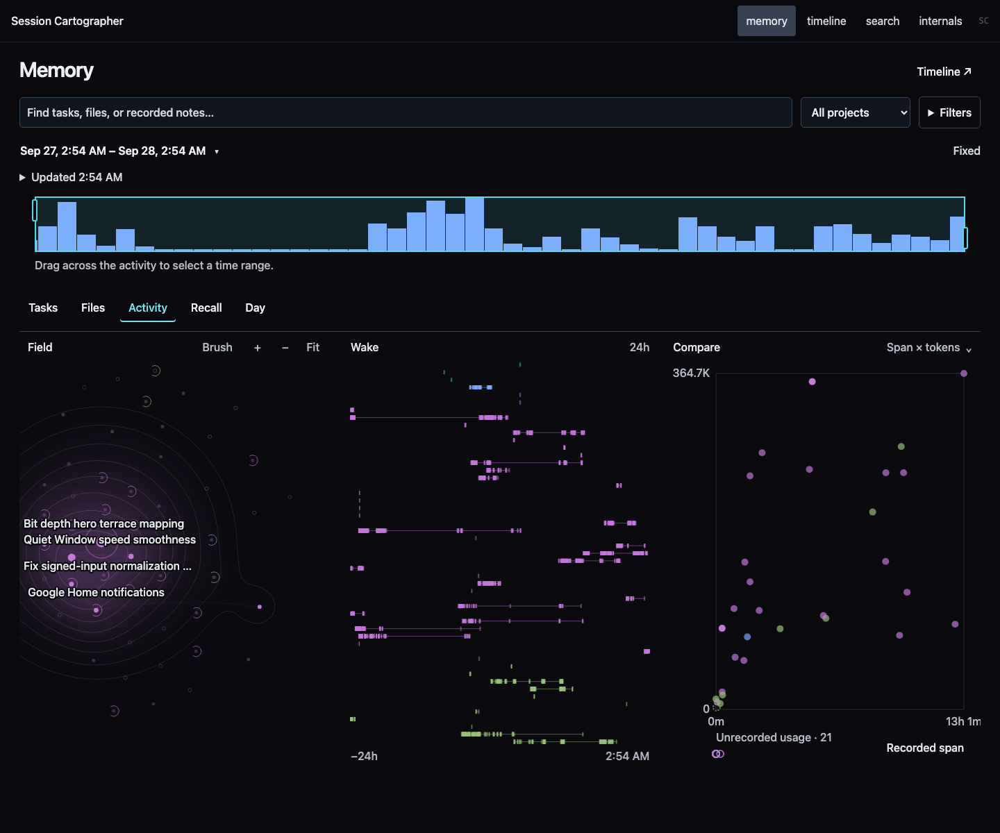
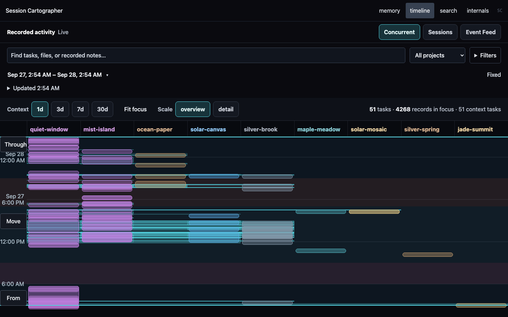

# Session Cartographer

Shared, searchable session history for **Claude Code and Codex**. Recover a
past decision, find the session behind a change, or pick up work after an absence.
Both agents contribute to the same local history and can recall each other's work.

Hooks write JSONL events. Search, the Explorer, and session digests are independent
ways to read them; keyword recall needs no server, and semantic search is optional.

[Try the Explorer demo](https://andyed.github.io/session-cartographer/) ·
[Download a release](https://github.com/andyed/session-cartographer/releases) ·
[Setup guide](docs/SETUP.md) · [Changelog](CHANGELOG.md)



*Real recorded activity, with project and file names replaced for these screenshots.*

## What you can do

| Task | Skill | Result |
| --- | --- | --- |
| Recover context | `/remember <question>` | Ranked evidence with links back to source transcripts |
| Orient on a project | `/remember --project <name>` | Recent work, related projects, and recurring procedures |
| Browse visually | `/carto` | Explorer search, timeline, transcripts, and the Memory Desk |
| Check concurrent work | `/standup` | Recent peer activity, shared-file edits, and commit attribution |
| Preserve a decision | `/wrapup` | A session digest plus decisions, discoveries, and unfinished work |
| Investigate a bug | `/investigate <bug>` | Prior diagnoses and a new hypothesis tracked through verification |
| Speed up recall | `/turbo` | Enable, inspect, or disable the shared warm search service |

These are Claude Code command names. In Codex, invoke the corresponding skill,
for example `$session-cartographer:remember` or `$session-cartographer:turbo`,
and describe the query or action. Project orientation replaces the retired
Cartographer `/focus` skill.

Additional skills: Codex's `$session-cartographer:setup` diagnoses local semantic
service access; `/trustmap` proposes Claude Code auto-mode environment settings
from recorded usage. See [auto-mode guidance](docs/AUTO_MODE.md).

## Install

Download and extract `session-cartographer-<version>.tar.gz` from
[Releases](https://github.com/andyed/session-cartographer/releases), keeping the
extracted directory in a stable location. One bundle supports both agents.
Run the commands for your agent from that directory:

```bash
# Codex
codex plugin marketplace add "$PWD"
codex plugin add session-cartographer@session-cartographer

# Claude Code
claude plugin marketplace add "$PWD"
claude plugin install session-cartographer@session-cartographer
```

A source checkout can be registered with the same commands.

**Codex hook approval:** launch the Codex CLI, run `/hooks`, select Session
Cartographer, and approve its hook definitions. Repeat when an update changes
those definitions. Start a fresh task/session after installation or approval.

**Choose your history location.** The corpus defaults to `~/Documents/dev`.
Set `CARTOGRAPHER_DEV_DIR` in the environment used by your agent if your workspace
lives elsewhere. File edits, commands, and Git commit capture require the opt-in
`CARTOGRAPHER_LOG_TOOL_USE=true`. Logs can contain verbatim prompts and command
lines; keep them out of version control.

Read [Adopting Cartographer](docs/ADOPTING.md) for corpus ownership, project
aliases, privacy, and resource use. [Release installation](docs/RELEASE_INSTALL.md)
covers bundle verification and upgrades.

### Optional semantic search

Keyword search works immediately against captured events. Add local Qdrant and
an embedding server to search by meaning and recall indexed conversation turns.
Follow [Setup](docs/SETUP.md); no Docker is required. In Codex, use
`$session-cartographer:setup` to diagnose access and request the necessary
loopback permissions. A sandbox-denied request does not establish that a service
is down.

### Optional Explorer

From a source checkout:

```bash
npm ci --prefix explorer
npm run dev --prefix explorer
```

In a release bundle, the Explorer directory is
`plugins/session-cartographer/explorer`; use that path instead. Open
[127.0.0.1:2527](http://127.0.0.1:2527/), or use `/carto` after installing its
dependencies. The UI binds to loopback only.

Timeline, search, sessions, and transcripts work without Turbo. The Memory Desk
uses the managed Turbo backend and offers **Start**, **Enable**, or **Refresh
Turbo** when needed. Opening the page directly does not start that backend.

## Everyday use

Ask `/remember` a concrete question, then narrow by project or date when needed:

```text
/remember why did we change the retry policy
/remember --project my-app
/remember deployment --project my-app --since 7d
```

Search summaries are intentionally short. Follow the transcript to recover the
conversation, or fetch complete event records from a checkout:

```bash
bash scripts/cartographer-search.sh "retry policy" --project my-app
bash scripts/cartographer-search.sh "lookup" --get evt-abc,evt-def
```

Repeated searches in one session suppress previously served IDs; `--all` includes
them again. `--transcript` adds a raw-text fallback for conversations that have
not been semantically indexed. For older material, scope the date window rather
than treating an absent top result as proof that the history is missing.

For standing questions about the overall work, `.carto/profile.md` is a derived
corpus summary. Rebuild it with `node scripts/build-profile.js`. Project aliases,
bounded feeds for other agents, and briefings are described in
[Project Registry & Briefings](docs/BRIEFINGS.md).

### Memory Desk and digests



The Explorer's **Memory Desk** is an evolving workspace for returning to tasks
and inspecting their evidence. It includes:

- A shared time range, project and text filters, and saved return points.
- Task and file browsing, linked activity charts, and transcript navigation.
- Current-file previews and Git diffs bounded by a session's recorded activity.
- **Recall**, showing searches, ranked results, and explicitly marked uses.
- **Day**, grouping a local calendar day's work by project and checking commits
  against Git, with a copyable Markdown receipt.

Session and file links preserve the selected context. File content is current;
diff boundaries use commit times and can include other sessions' changes.
Recent activity is evidence of an event, not proof that an agent is still running.
See [the work desk](docs/WORK_DESK.md) and
[Memory link reference](plugins/session-cartographer/skills/carto/SKILL.md#deep-links-into-memory-share-with-the-operator).

The same digests are available without the UI:

```bash
node scripts/session-digest.js --session <session-id>
node scripts/session-digest.js --day yesterday --md
```

`/wrapup` adds the reasoning hooks cannot capture: decisions, discoveries, and
open questions. It is useful for material sessions; ordinary sessions already
have their automatic history. `/standup` reports recent activity and file overlap;
[shared-goal briefings and handoff records](docs/STANDUP_SHARED_GOAL_PLAN.md)
remain planned.

### Turbo Mode

Turbo keeps the search index in memory so each recall avoids rereading the corpus.
One setting covers both agents, in `~/.config/session-cartographer/config.json`.
Use `/turbo enable`, `/turbo status`, or `/turbo disable` in Claude Code; in Codex,
invoke `$session-cartographer:turbo` and request the action.

Turbo starts disabled. The `/carto` skill enables it automatically on machines
with at least 16 GB RAM when the estimated index fits within 8% of RAM; otherwise
it leaves the choice to you. On machines below 16 GB, an enabled service defaults
to exiting after 30 idle minutes. Status reports the local memory estimate.

Ordinary recall uses the warm service through loopback HTTP or a private file
transport for restricted sandboxes. An unavailable or incompatible service falls
back to the portable CLI; `--no-turbo` forces that path. Exact record operations
such as `--get` stay on the portable path. The two backends can rank differently.
See [Turbo Mode](docs/TURBO_MODE_SPEC.md) for behavior and evaluation.

## Bring existing history

Hooks capture future activity. To seed a new corpus, run these from a checkout
(or the release bundle's `plugins/session-cartographer` directory):

```bash
# Preview your configured authors' commits before importing; remove --dry-run to write.
bash scripts/backfill-git-history.sh --project my-app --since 2026-01-01 --dry-run

# Import native Claude Code and Codex memory into the event logs.
bash scripts/backfill-memories.sh

# Index historical conversation turns; requires Qdrant and the embedding server.
bash scripts/retro-index.sh --limit-days 30
```

Native memory files remain authoritative; import does not edit them.
[Codex memory migration](docs/MIGRATION_CODEX_MEMORY.md) covers semantic indexing
and refresh. [Setup](docs/SETUP.md) covers deeper reconstruction and older-data
repairs; [turn migration](docs/MIGRATION_TURNS.md) explains transcript indexing.

## How it works

```text
Claude Code / Codex hooks → shared JSONL event logs
                            ├── /remember: keyword + optional semantic recall
                            ├── Explorer: browse sessions and inspect work
                            ├── digests and /wrapup: activity and judgment
                            └── Qdrant indexer: semantic event and turn search
```

The portable keyword scorer is bash + awk. The API has a separate JavaScript
scorer. Both combine BM25 keyword ranking with optional Qdrant results through
Reciprocal Rank Fusion. Transcript turns are grouped at indexing time; the
original transcripts remain the source for full context.

The default configuration keeps capture, storage, search, and embeddings local.
Hooks preserve provider provenance while both agents search the shared corpus.
The [co-occurrence graph](docs/COOCCURRENCE.md) uses structured project and
procedure signals to support orientation and procedural recall.

Coverage depends on enabled hooks, retained transcripts, and completed imports.
Keyword search has no exact phrase matching or stemming, and its tokenizer is
focused on Latin scripts. Semantic search broadens matching but does not guarantee
that every relevant session will rank. See [scoring](docs/SCORING.md),
[rank fusion](docs/RANK_FUSION.md), and [archival recall](docs/ARCHIVAL_RECALL.md).

## Development and reference

Use Node 22 for development and CI parity. The public unit suite is:

```bash
env -u CLAUDE_SESSION_ID -u CLAUDE_CODE_SESSION_ID -u CODEX_SESSION_ID -u CARTOGRAPHER_SESSION_ID \
  node --test tests/unit/*.test.js
```

Read [Testing](docs/TESTING.md) for dependency setup, isolated browser tests,
packaging checks, and safeguards against writing test data into a live corpus.
`tests/private/` is optional and is not needed by fresh clones or public CI.

To capture the Explorer with randomized names over your own activity, use the
[JavaScript screenshot tool](tools/screenshots/README.md).

- [Provider architecture](docs/PROVIDERS.md), [log schemas](docs/LOG_SCHEMAS.md),
  and [custom hooks](docs/CUSTOM_HOOKS.md)
- [Explorer architecture](docs/EXPLORER_SPEC.md) and [Internals](docs/INTERNALS.md)
- [Demo and evaluation](docs/GHPAGES_DEMO_SPEC.md) and
  [related projects](docs/landscape-survey.md)

## Credits and license

Search originated in a fork of Shreyas Patil's
[claude-code-session-bridge](https://github.com/PatilShreyas/claude-code-session-bridge).
The co-occurrence graph was inspired by DeepBlueDynamics'
[lume](https://github.com/DeepBlueDynamics/lume) and the Semantic Knowledge Graph
work of Trey Grainger and Erik Hatcher; Cartographer ranks structured session
entities with Dunning's log-likelihood ratio (G²).

[MIT](LICENSE).
